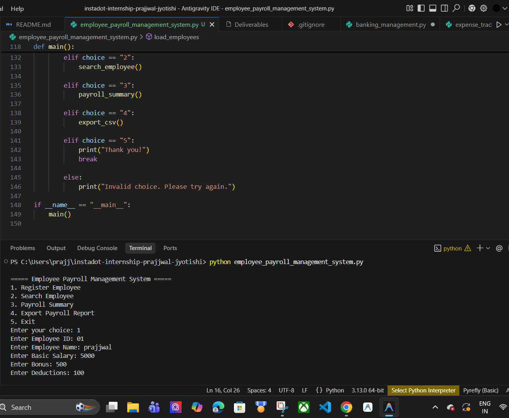
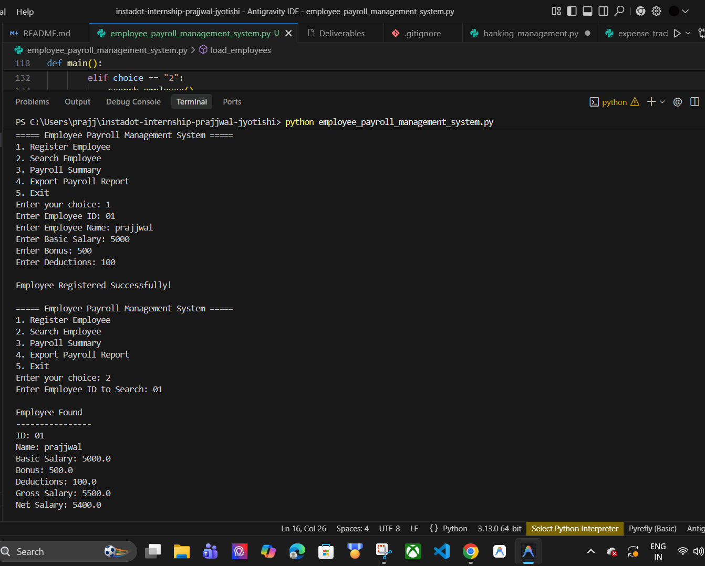
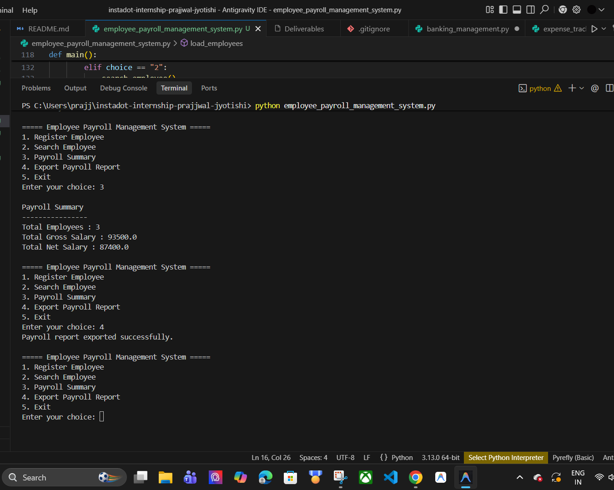

# 🧾 Employee Payroll Management System

> **Day 05 — Instadot Analytics Internship**
> Developed by **Prajjwal Jyotishi**

---

## 📌 Overview

A command-line based **Employee Payroll Management System** built in Python that allows organizations to manage employee records efficiently. It supports employee registration, salary computation, record search, payroll summaries, and report exports — all with persistent data storage using JSON.

---

## 🚀 Features

| Feature | Description |
|---|---|
| ✅ Register Employee | Add new employees with salary details |
| 🔍 Search by ID | Instantly look up any employee record |
| 📊 Payroll Summary | View total employees, gross & net salary |
| 📤 Export to CSV | Generate downloadable payroll reports |
| 💾 Persistent Storage | All data saved to `employees.json` |
| 🛡️ Duplicate Check | Prevents duplicate Employee IDs |
| ⚠️ Input Validation | Handles invalid/non-numeric inputs gracefully |

---

## 🧮 Salary Calculation Logic

```
Gross Salary = Basic Salary + Bonus
Net Salary   = Gross Salary - Deductions
```

---

## 🛠️ Technologies Used

- **Language:** Python 3.x
- **Storage:** JSON (persistent data)
- **Export:** CSV (payroll reports)
- **Modules:** `json`, `csv`, `os`

---

## 📁 Project Structure

```
instadot-internship-prajjwal-jyotishi/
│
├── employee_payroll_management_system.py   # Main application file
├── employees.json                          # Auto-generated employee data store
├── payroll_report.csv                      # Auto-generated CSV export
│
└── output_screenshots/                     # Output proof screenshots
    ├── output_register_employee.png
    ├── output_search_employee.png
    └── output_payroll_summary_export.png
```

---

## ▶️ How to Run

**1. Clone the repository**
```bash
git clone https://github.com/Prajjwal-Jyotishi/instadot-internship-prajjwal-jyotishi.git
cd instadot-internship-prajjwal-jyotishi
git checkout day-05
```

**2. Run the program**
```bash
python employee_payroll_management_system.py
```

> No additional packages required — uses Python standard library only.

---

## 📋 Menu Options

```
===== Employee Payroll Management System =====
1. Register Employee
2. Search Employee
3. Payroll Summary
4. Export Payroll Report
5. Exit
```

---

## 💡 Sample Usage

### ➕ Registering an Employee
```
Enter Employee ID: 01
Enter Employee Name: Prajjwal
Enter Basic Salary: 5000
Enter Bonus: 500
Enter Deductions: 100

Employee Registered Successfully!
```

### 🔍 Searching an Employee
```
Enter Employee ID to Search: 01

Employee Found
----------------
ID: 01
Name: Prajjwal
Basic Salary: 5000.0
Bonus: 500.0
Deductions: 100.0
Gross Salary: 5500.0
Net Salary: 5400.0
```

### 📊 Payroll Summary
```
Payroll Summary
----------------
Total Employees : 3
Total Gross Salary : 93500.0
Total Net Salary : 87400.0
```

### 📤 Export Report
```
Payroll report exported successfully.
```

---

## 🖼️ Output Screenshots

### Employee Registration & Search


### Employee Search Details


### Payroll Summary & CSV Export


---

## 📂 Generated Files

| File | Description |
|---|---|
| `employees.json` | Stores all employee records in JSON format |
| `payroll_report.csv` | Exported CSV report with all payroll data |

---

## 👨‍💻 Author

**Prajjwal Jyotishi**
Instadot Analytics Internship — Day 05
