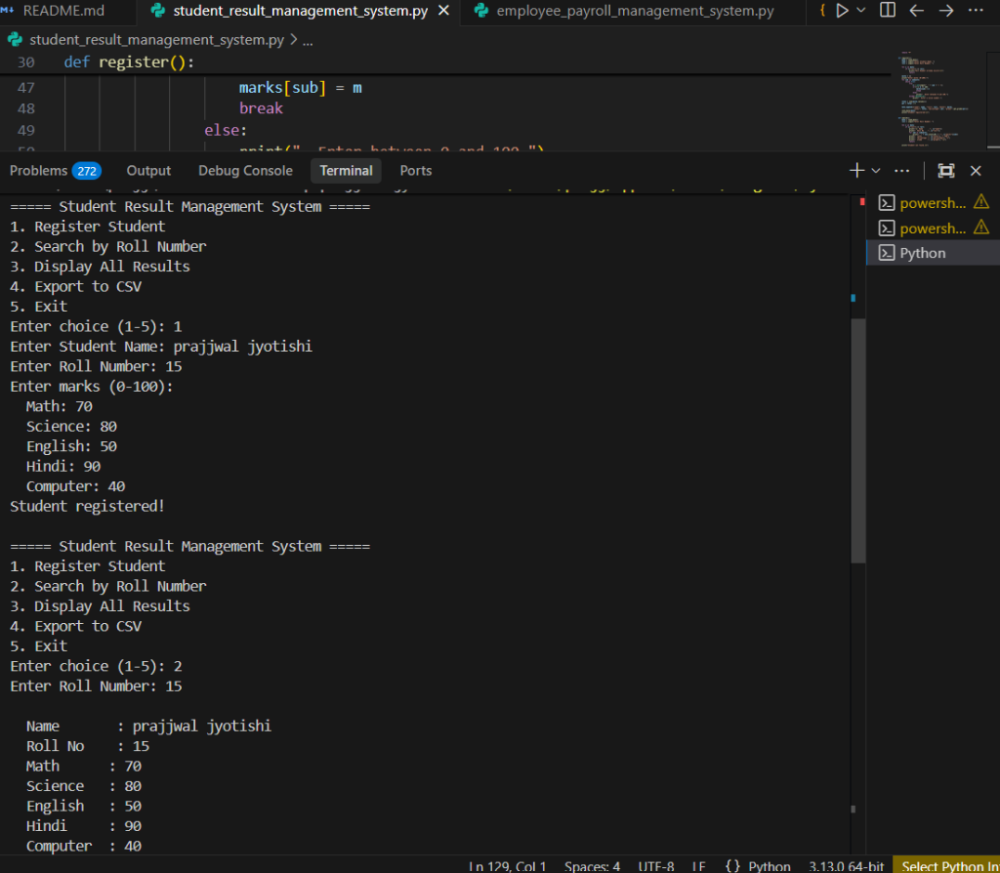
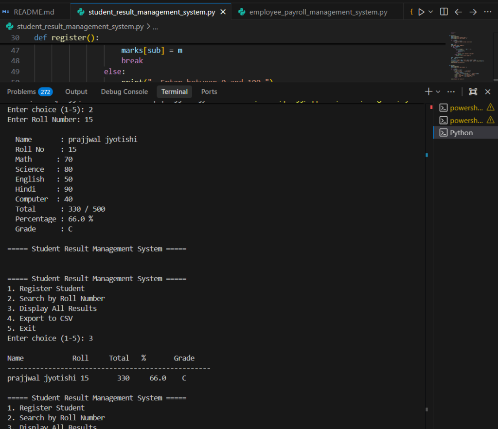
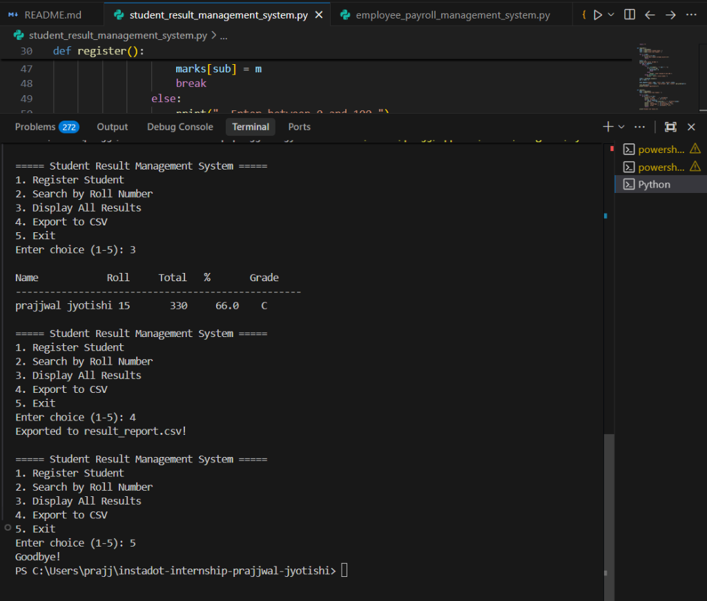
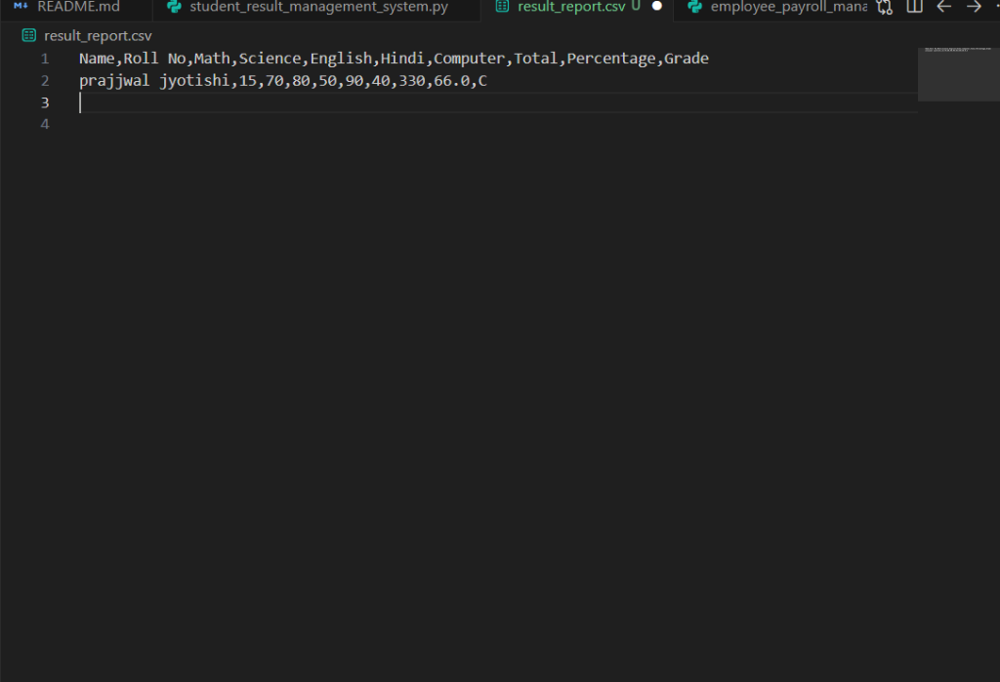

# Day 07 – Student Result Management System

## Objective

Build a Student Result Management System in Python that allows registering students, entering marks for five subjects, calculating total marks, percentage and grade, storing data in JSON, searching students by roll number, displaying result summaries, and exporting reports to CSV.

## Features Implemented

### Student Registration

* Register students with Name and Roll Number
* Duplicate roll number check to prevent duplicate entries

### Enter Marks for Five Subjects

* Marks entered for Math, Science, English, Hindi, and Computer
* Input validation ensures marks are between 0 and 100

### Calculate Total Marks, Percentage, and Grade

* Total calculated as sum of all five subject marks
* Percentage calculated as total divided by number of subjects
* Grade assigned based on percentage:
  * A+ (90% and above)
  * A (80% and above)
  * B (70% and above)
  * C (60% and above)
  * D (50% and above)
  * F (below 50%)

### Store Data Using JSON

* Student data stored in `students.json` file
* Data persists between program runs

### Search Students by Roll Number

* Search and display complete result of a student using their roll number

### Display Result Summary

* View all registered students in a formatted table with Name, Roll No, Total, Percentage, and Grade

### Export Result Report to CSV (Bonus Task)

* Export all student results to `result_report.csv`
* CSV includes Name, Roll No, subject-wise marks, Total, Percentage, and Grade

## Technologies Used

* Python 3
* JSON File Handling
* CSV Module
* Input Validation with Exception Handling

## Files Included

### student_result_management_system.py

Main application file containing student registration, marks entry, grade calculation, search, display, and CSV export functionality.

### students.json

JSON file storing all registered student data (created automatically on first registration).

### result_report.csv

CSV export of all student results (created when export option is used).

## Learning Outcomes

* JSON File Reading and Writing
* CSV File Export
* Input Validation and Exception Handling
* Dictionary and List Operations
* Menu-Driven Program Design

## Output Screenshots

