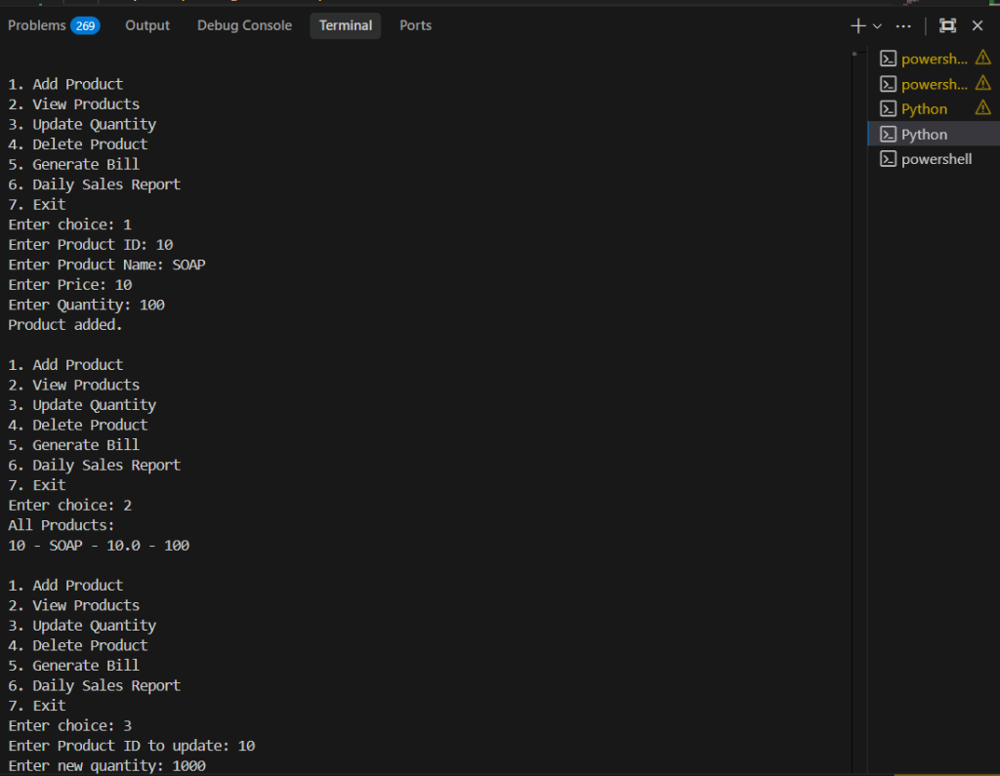
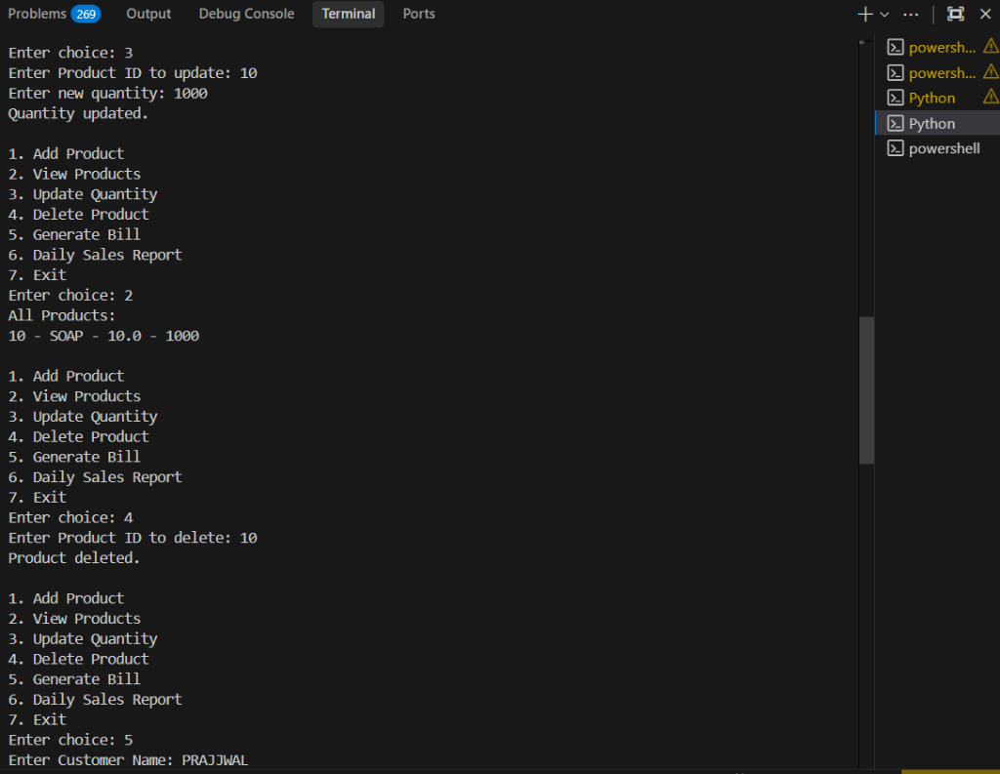
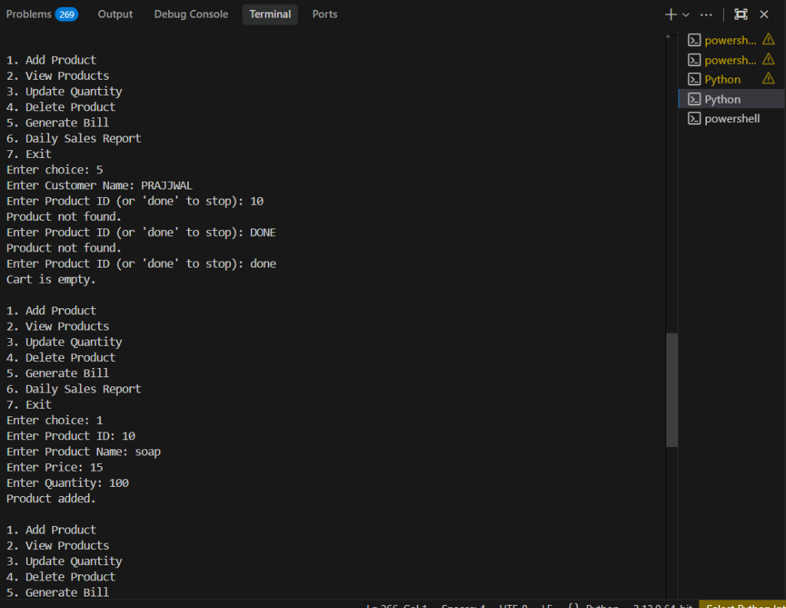
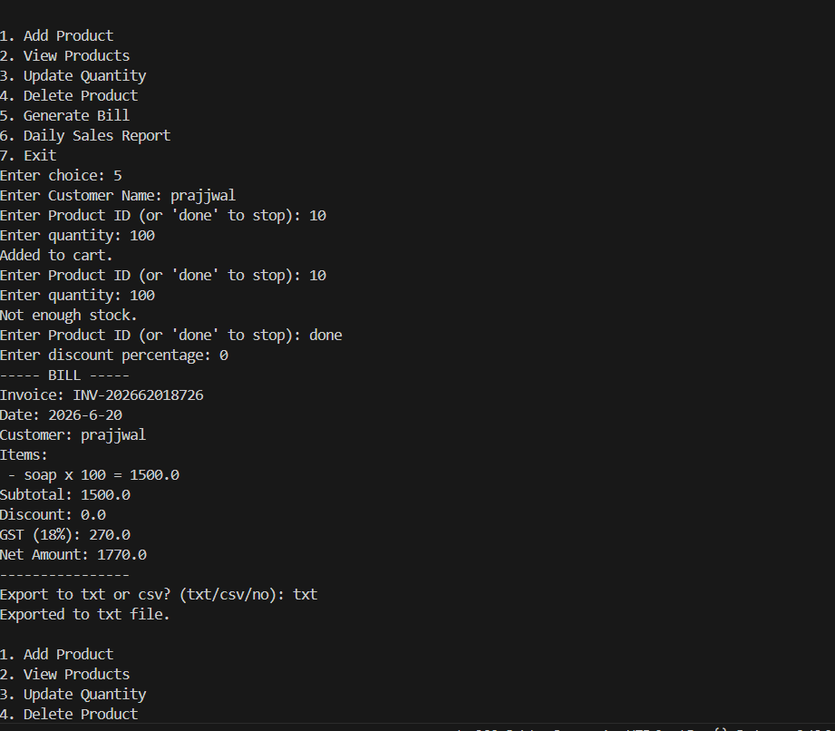

# Day 08 – Inventory & Billing System

## Objective

Build an Inventory & Billing System in Python that manages product records (add, update, delete), generates customer bills with GST and discount calculations, stores data using JSON files, generates a daily sales report, and exports invoices as TXT or CSV files.

## Features Implemented

1. **Add Product:** Add a new product (id, name, price, qty).
2. **View Products:** See all current products.
3. **Update Quantity:** Change the stock for an existing product.
4. **Delete Product:** Remove a product.
5. **Generate Bill:**
   - Add items by Product ID.
   - Calculates Subtotal, Discount, GST (18%), and Net Amount.
   - Auto-updates the product stock.
6. **Sales Report:** Prints a summary of today's sales.
7. **Export:** Export generated invoice to `.txt` or `.csv`.
8. **Data Storage:** Uses `products.json` and `sales.json` to store data permanently.

## How to Run

```bash
python inventory_billing_system.py
```

## Files

- `inventory_billing_system.py`: The main program.

## Output Screenshots








