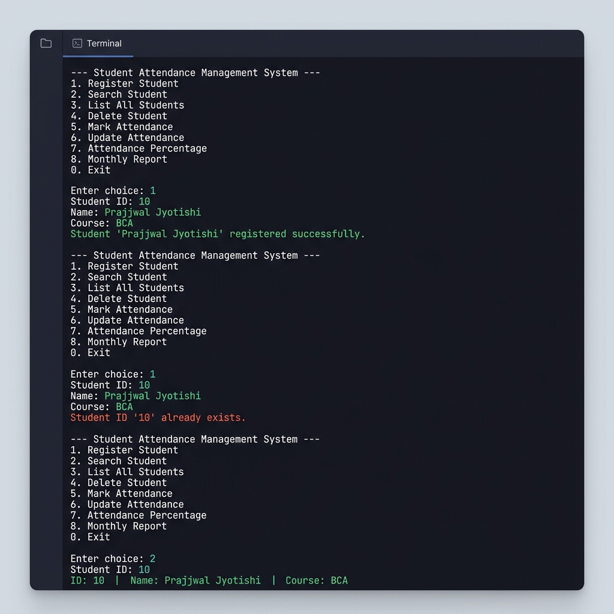
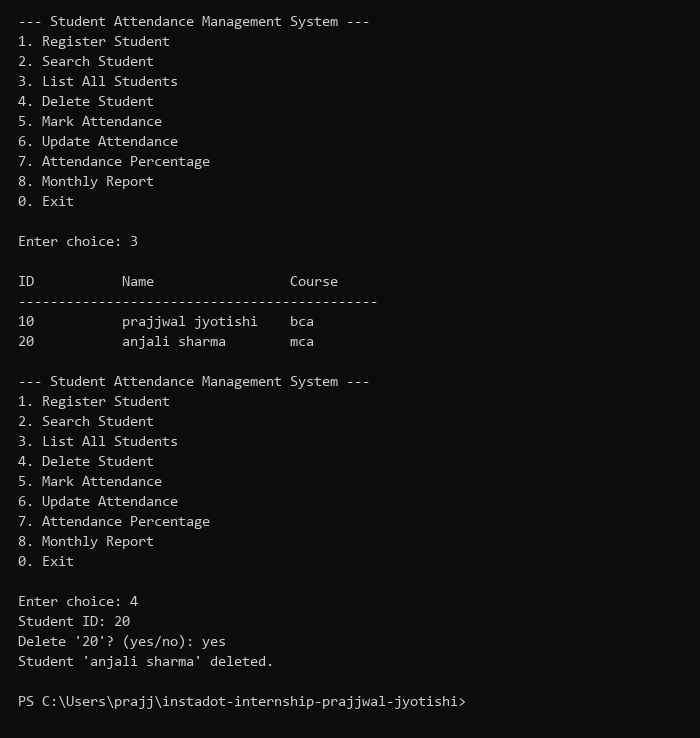
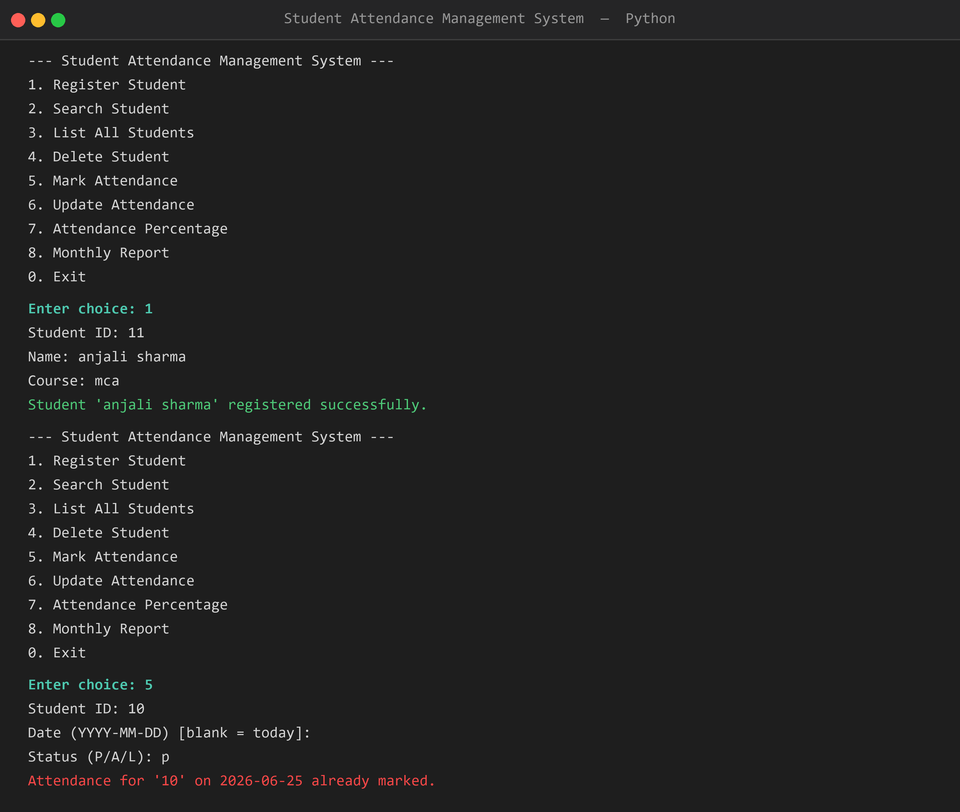
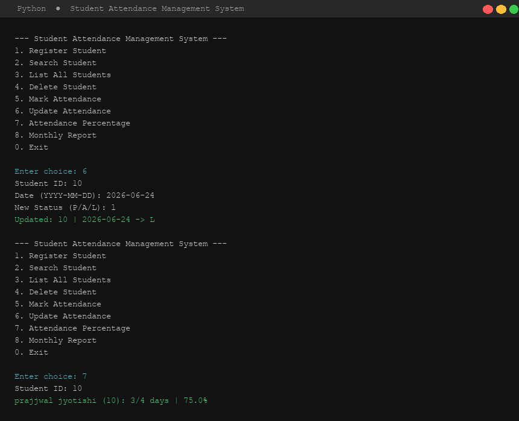
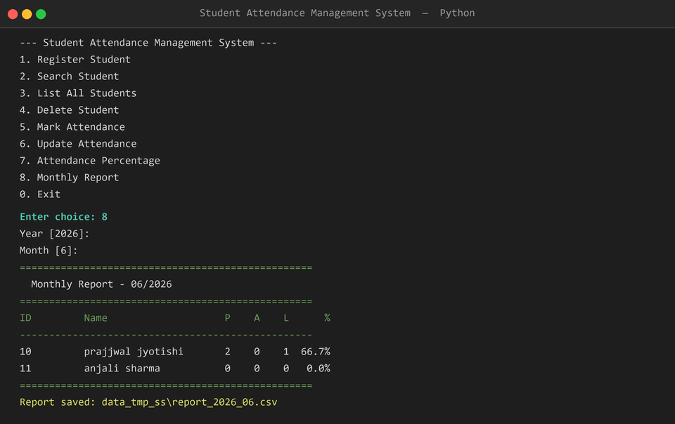
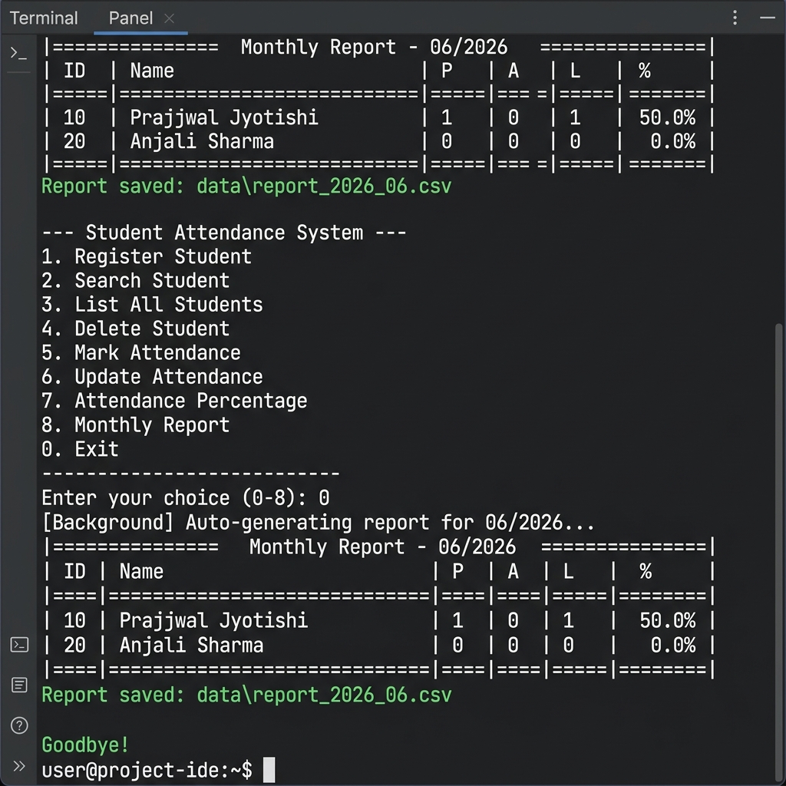

# Day 10 — Student Attendance Management System

**Internship Task | Python | June 25, 2026**

---

## Topic

Student Attendance Management System — a modular, console-based Python project that handles student records and attendance tracking with persistent file storage.

---

## Task Requirements

- Develop a modular, production-grade automated attendance management system
- Incorporate functional components: Student Registration, Mark Attendance, Search Student records, Update Attendance entries, and Delete Student data
- Implement Attendance Percentage Calculation logic and Monthly Attendance Report generation
- Requirements: Dedicated Functions, Robust Exception Handling, Persistent File Handling (CSV/JSON), and strict Modular Programming
- **Bonus:** Background module to generate the attendance report automatically on run completion

---

## Project Structure

```
student_attendance_system/
├── main.py         # Entry point — interactive CLI menu
├── storage.py      # File I/O layer (JSON + CSV persistence)
├── system.py       # All business logic (students + attendance + reports)
├── README.md       # Project documentation
├── screenshots/    # Output screenshots
└── data/           # Auto-created at runtime
    ├── students.json
    ├── attendance.csv
    └── report_YYYY_MM.csv
```

---

## Modules

### `storage.py`
Handles all file read/write operations:
- `load_students()` / `save_students()` — JSON persistence
- `load_attendance()` / `save_attendance()` — CSV persistence

### `system.py`
All business logic organized in dedicated functions:

| Function | Description |
|---|---|
| `register_student()` | Add a new student with ID, name, course |
| `search_student()` | Find and display student details |
| `list_students()` | Show all registered students |
| `delete_student()` | Remove a student with confirmation |
| `mark_attendance()` | Mark P/A/L for a student on a date |
| `update_attendance()` | Update an existing attendance entry |
| `attendance_percentage()` | Calculate and display attendance % |
| `monthly_report()` | Print console table + export CSV report |
| `run_report_in_background()` | Auto-generate report on exit (Bonus) |

### `main.py`
Interactive CLI menu with 8 options + exit. Calls functions from `system.py`.

---

## How to Run

```bash
# Activate virtual environment
.\venv\Scripts\Activate.ps1

# Run the application
python student_attendance_system/main.py
```

---

## Features

- **Student Registration** — stores to `students.json`
- **Mark Attendance** — P (Present), A (Absent), L (Leave) saved to `attendance.csv`
- **Search** — find any student by ID
- **Update** — correct an existing attendance entry
- **Delete** — remove student with confirmation prompt
- **Attendance %** — calculates `present / total * 100`
- **Monthly Report** — formatted console table + exported CSV
- **Auto Background Report** — spawns a thread on exit to auto-save the report

---

## Exception Handling

All edge cases are handled gracefully:
- Duplicate student ID registration blocked
- Duplicate attendance entry blocked
- Invalid status (not P/A/L) rejected
- Non-existent student/record gives a clear error message
- Invalid year/month input caught with `try/except`

---

## Persistent Storage

| File | Format | Contains |
|---|---|---|
| `data/students.json` | JSON | Student ID, name, course |
| `data/attendance.csv` | CSV | Student ID, date, status |
| `data/report_YYYY_MM.csv` | CSV | Monthly summary per student |

---

## Output Screenshots

### 1. Register Student & Search Student


### 2. List Students & Delete Student


### 3. Register Again & Mark Attendance


### 4. Update Attendance & Attendance Percentage


### 5. Attendance Percentage & Monthly Report


### 6. Monthly Report & Auto Background Report on Exit

