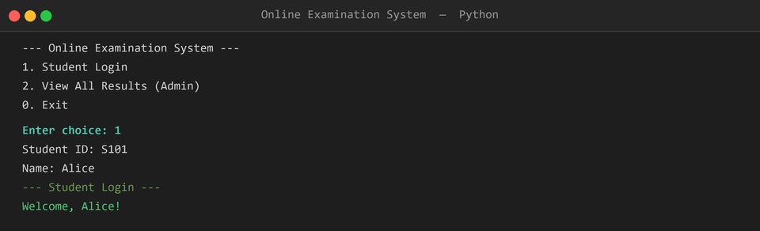
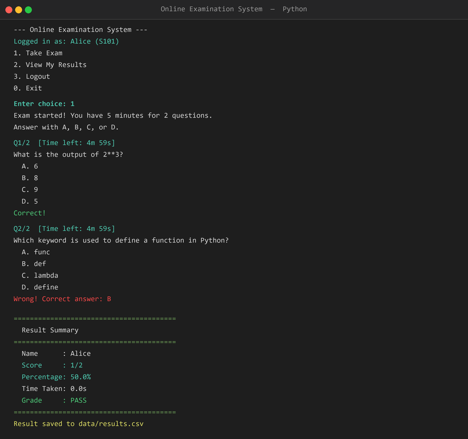
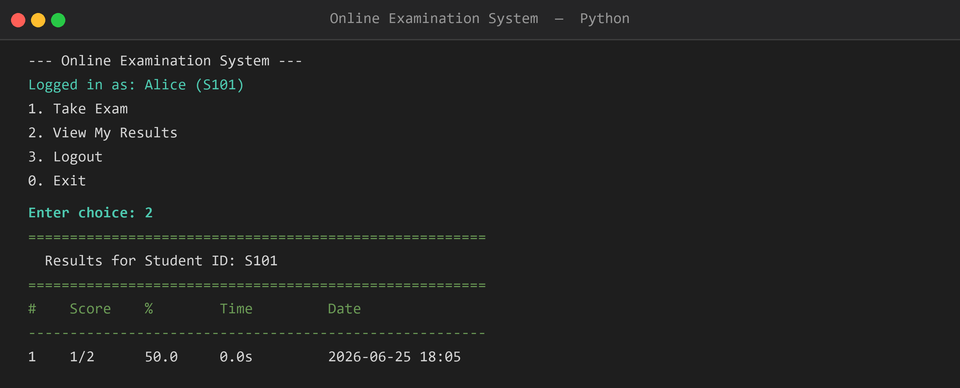
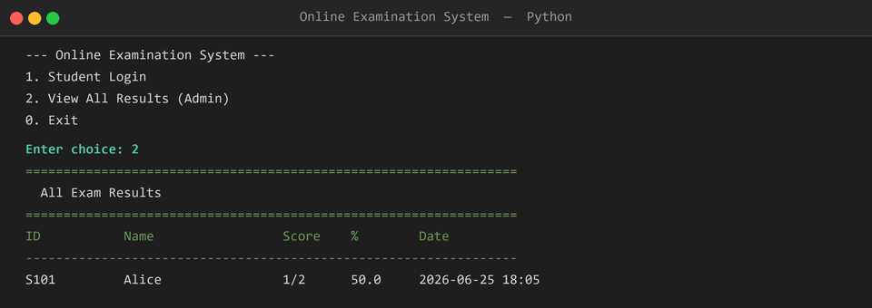

# Day 11 — Online Examination System

**Internship Task | Python | June 25, 2026**

---

## Topic

Online Examination System — a modular, console-based Python project that handles student login, timed multiple-choice exams, auto-scoring, and result storage in CSV.

---

## Task Requirements

- **Student Login**
- **Start Exam** with **Timer** and **Multiple Choice Questions**
- **Auto Score Calculation** and **Result Summary**
- **Store Results in CSV**
- **Technical Requirements:** Functions, File Handling (CSV), Exception Handling, Modular Programming
- **BONUS:** Randomize question order for every exam attempt

---

## Deliverables

| Deliverable | Status | Details |
|---|---|---|
| ✅ Python Project Structure | Complete | 3-layer modular structure: `storage.py` → `system.py` → `main.py` |
| ✅ GitHub Repository | Complete | [day-11 branch](https://github.com/Prajjwal-Jyotishi/instadot-internship-prajjwal-jyotishi/tree/day-11) |
| ✅ Clean Source Code | Complete | Minimal, readable, no unnecessary complexity |
| ✅ Console/UI Output Screenshots | Complete | 4 HD screenshots in `screenshots/` folder |

---

## Project Structure

```
online_exam_system/
├── main.py         # Entry point — interactive CLI menu
├── storage.py      # File I/O layer (CSV persistence for questions & results)
├── system.py       # All business logic (login, exam runner, auto-scoring, reports)
├── README.md       # Project documentation
├── screenshots/    # Output screenshots
└── data/           # Storage files
    ├── questions.csv
    └── results.csv
```

---

## Output Screenshots

### 1. Student Login


### 2. Take Exam (Timed, Auto-Scored, Randomized)


### 3. View My Results (Student)


### 4. View All Results (Admin)

