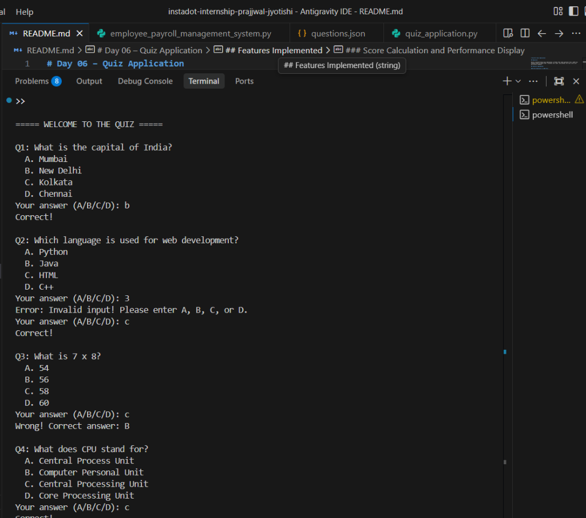
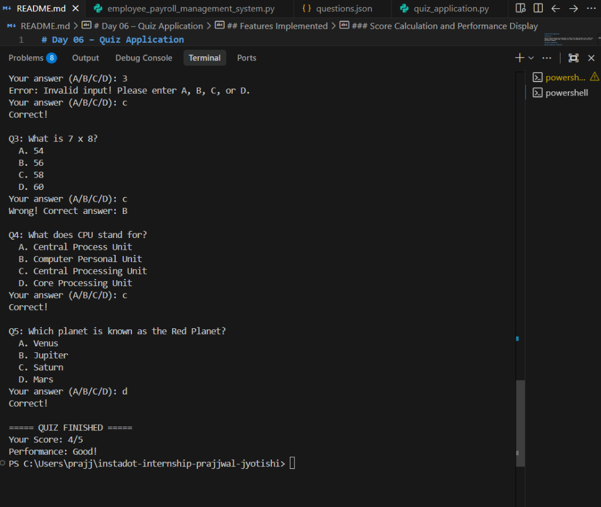

# Day 06 – Quiz Application

## Objective

Build a multiple-choice quiz application in Python that reads questions from a JSON file, presents them in random order, validates user input, and displays the final score with performance feedback.

## Features Implemented

### Store Questions in JSON File

* Questions stored in `questions.json` with question text, options, and correct answer

### Read Questions Dynamically

* Questions loaded at runtime using `json.load()`

### Shuffle Questions Randomly (Bonus)

* Questions are shuffled using `random.shuffle()` each time the quiz starts

### Score Calculation and Performance Display

* Tracks correct answers and calculates percentage
* Displays performance category:
  * Excellent (100%)
  * Good (60% and above)
  * Average (40% and above)
  * Poor (below 40%)

### Exception Handling

* Validates user input using `try/except ValueError`
* Only accepts A, B, C, or D as valid answers
* Re-prompts on invalid input

## Technologies Used

* Python 3
* JSON File Handling
* Random Module
* Exception Handling

## Files Included

### quiz_application.py

Main application file containing the quiz logic, input validation, score calculation, and performance display.

### questions.json

JSON file storing the quiz questions with options and correct answers.

## Learning Outcomes

* JSON File Reading
* Random Shuffling
* Exception Handling
* Score Calculation and Conditional Logic

## Output Screenshots

