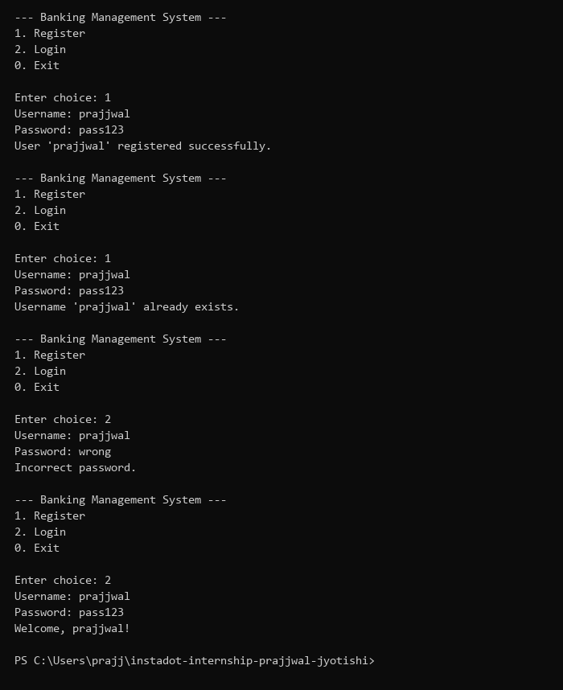
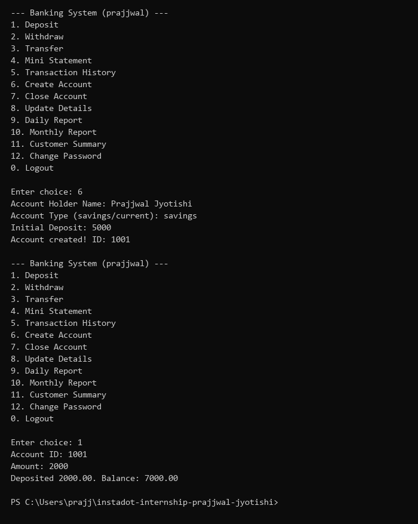
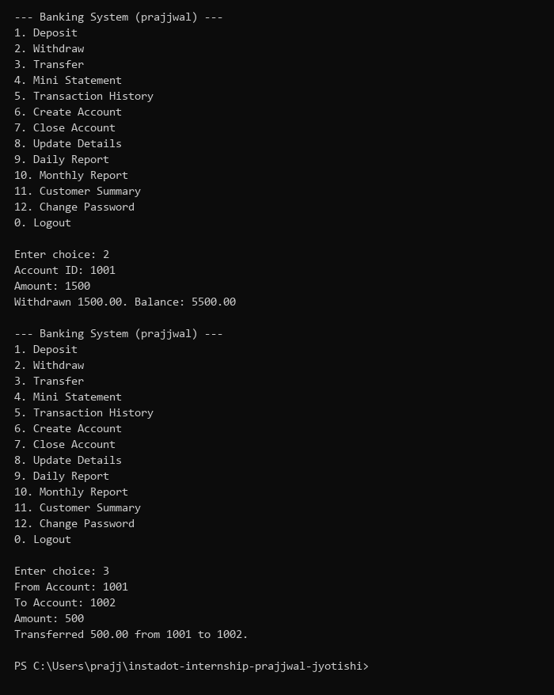
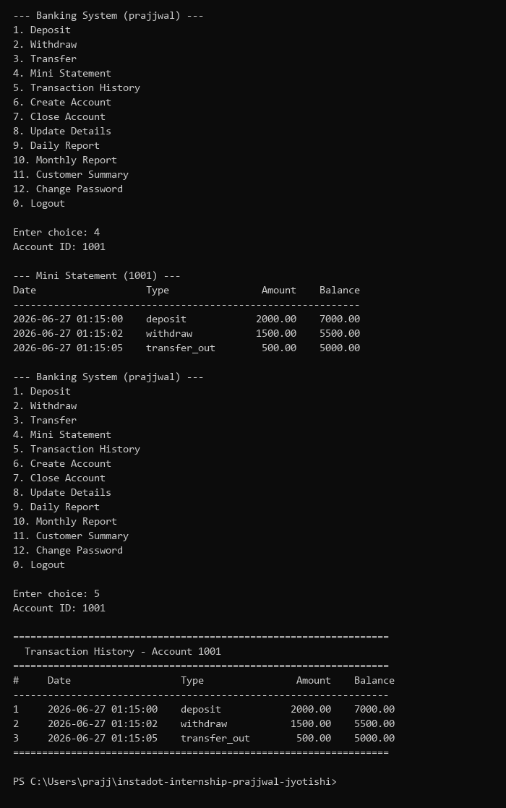
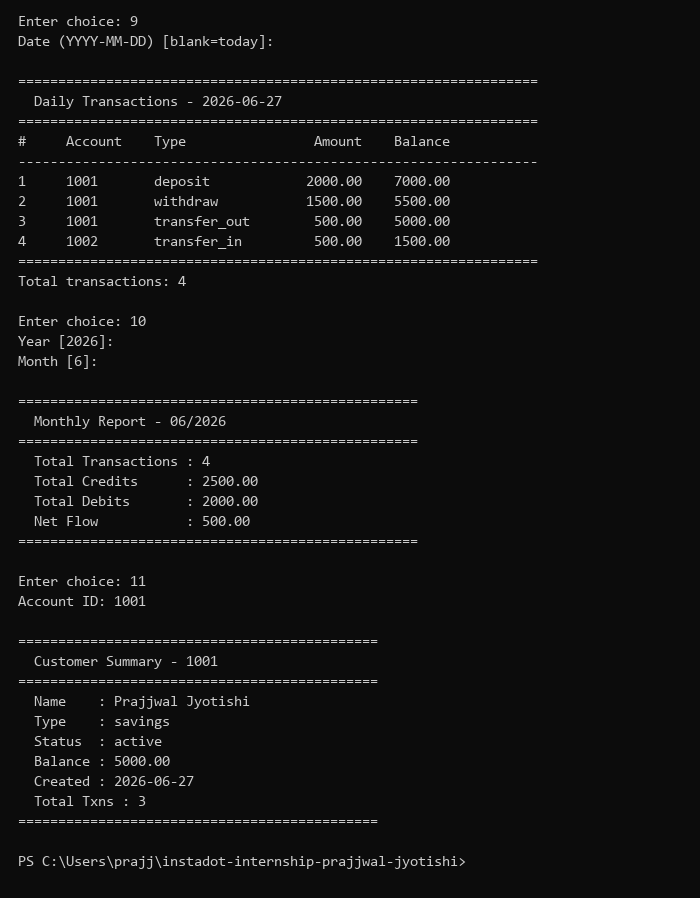
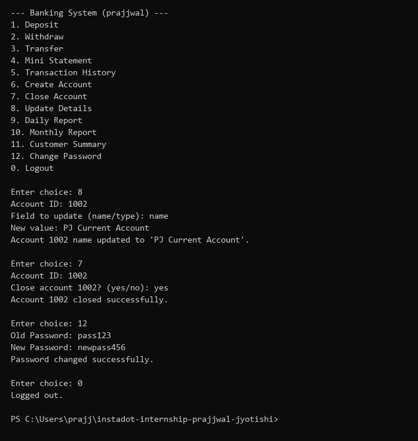

# Day 12 — Banking Management System

**Internship Task | Python | June 27, 2026**

---

## Topic

Banking Management System — a modular, console-based Python project with authentication, banking operations, account management, and reporting with persistent JSON storage.

---

## Task Requirements

- Develop a modular Banking Management System (Console Application)
- **Authentication:** Login, Register, Change Password
- **Banking:** Deposit, Withdraw, Transfer Money, Mini Statement, Transaction History
- **Account Management:** Create Account, Close Account, Update Details
- **Reports:** Daily Transactions, Monthly Report, Customer Summary
- Requirements: Functions, Modules, File Handling, Exception Handling, JSON Storage, Logging
- **Bonus:** Encrypt passwords before saving (SHA-256)

---

## Deliverables

| Deliverable | Status | Details |
|---|---|---|
| ✅ Python Project Structure | Complete | 6-module structure: `storage` → `auth`/`accounts`/`banking`/`reports` → `main` |
| ✅ GitHub Repository | Complete | [day-12 branch](https://github.com/Prajjwal-Jyotishi/instadot-internship-prajjwal-jyotishi/tree/day-12) |
| ✅ Clean Source Code | Complete | Minimal, readable, modular |
| ✅ Console Output Screenshots | Complete | 6 screenshots in `screenshots/` folder |
| ✅ Bonus: Password Encryption | Complete | SHA-256 hashing via `hashlib` |

---

## Project Structure

```
banking_system/
├── main.py          # Entry point — two-phase CLI menu (auth + banking)
├── storage.py       # File I/O layer (JSON persistence + logging setup)
├── auth.py          # Authentication — register, login, change password (SHA-256)
├── accounts.py      # Account management — create, close, update details
├── banking.py       # Banking ops — deposit, withdraw, transfer, statements
├── reports.py       # Reports — daily transactions, monthly report, customer summary
├── screenshots/     # Output screenshots
└── data/            # Auto-created at runtime
    ├── users.json         # User credentials (encrypted passwords)
    ├── accounts.json      # Account details
    ├── transactions.json  # All transaction records
    └── banking.log        # Application log
```

---

## Modules

### `storage.py`
Generic JSON file I/O and logging setup:
- `load(filepath)` / `save(filepath, data)` — JSON persistence
- `setup_logging()` — configure logging to `data/banking.log`

### `auth.py`
Authentication with SHA-256 password encryption:

| Function | Description |
|---|---|
| `hash_pw()` | SHA-256 password hashing (Bonus) |
| `register_user()` | Create new user with encrypted password |
| `login_user()` | Verify credentials and login |
| `change_password()` | Update password after verification |

### `accounts.py`
Account management with auto-generated IDs:

| Function | Description |
|---|---|
| `create_account()` | Create account with ID, name, type, initial deposit |
| `close_account()` | Soft-close an account (set status to closed) |
| `update_details()` | Update account name or type |
| `get_account()` | Lookup helper |

### `banking.py`
Core banking operations with transaction logging:

| Function | Description |
|---|---|
| `deposit()` | Add funds to account |
| `withdraw()` | Deduct funds with balance check |
| `transfer()` | Transfer between two accounts |
| `mini_statement()` | Last 5 transactions |
| `transaction_history()` | Full formatted transaction table |

### `reports.py`
Reporting and analytics:

| Function | Description |
|---|---|
| `daily_transactions()` | All transactions on a given date |
| `monthly_report()` | Monthly summary with credits/debits/net flow |
| `customer_summary()` | Full account overview |

### `main.py`
Two-phase interactive CLI:
1. **Auth Menu** — Register / Login / Exit
2. **Banking Menu** — 12 options + Logout

---

## How to Run

```bash
# Run the application
python banking_system/main.py
```

---

## Features

- **User Registration** — with SHA-256 encrypted passwords (Bonus)
- **Login/Logout** — session-based authentication
- **Create Account** — savings or current, auto-generated IDs starting from 1001
- **Deposit/Withdraw** — with balance validation
- **Transfer** — between any two active accounts
- **Mini Statement** — last 5 transactions
- **Transaction History** — full formatted table
- **Daily Report** — all transactions on a date
- **Monthly Report** — credits, debits, net flow summary
- **Customer Summary** — complete account overview
- **Update Details** — change account name or type
- **Close Account** — soft-close with balance reset
- **Change Password** — with old password verification
- **Logging** — all operations logged to `data/banking.log`

---

## Exception Handling

All edge cases handled gracefully:
- Duplicate username registration blocked
- Invalid login credentials give clear error
- Insufficient balance for withdraw/transfer
- Negative/zero amount validation
- Non-existent account ID gives error message
- Closed account operations blocked
- Invalid menu input caught with `try/except`

---

## Persistent Storage

| File | Format | Contains |
|---|---|---|
| `data/users.json` | JSON | Username, encrypted password, account list |
| `data/accounts.json` | JSON | Account ID, owner, name, type, balance, status |
| `data/transactions.json` | JSON | Transaction ID, account, type, amount, balance, date |
| `data/banking.log` | Log | Timestamped application events |

---

## Output Screenshots

### 1. Register & Login


### 2. Create Account & Deposit


### 3. Withdraw & Transfer


### 4. Mini Statement & Transaction History


### 5. Daily Transactions, Monthly Report & Customer Summary


### 6. Update Details, Close Account & Change Password

